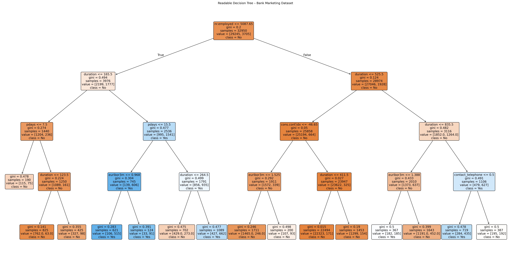
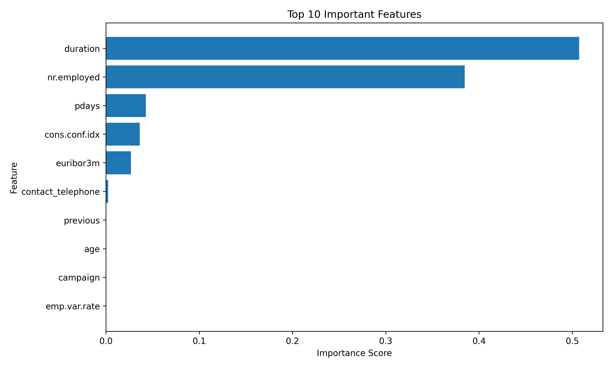

# Bank Marketing Decision Tree Classifier

## 📌 Project Overview
This project builds a **Decision Tree Classifier** to predict whether a customer will subscribe to a **term deposit** based on the Bank Marketing dataset.  
The goal is to analyze customer behavior and build an interpretable machine learning model.

---

## 📊 Dataset
- Source: UCI Machine Learning Repository
- Records: 41,188
- Features: 20 input features + 1 target
- Target variable:
  - `y` → Whether the customer subscribed (`yes` / `no`)

---

## 🛠️ Technologies Used
- Python
- Pandas
- NumPy
- Matplotlib
- Scikit-learn

---

## 🔄 Workflow
1. Load and explore the dataset  
2. Encode categorical variables using one-hot encoding  
3. Split data into training and testing sets  
4. Train a Decision Tree Classifier  
5. Evaluate the model using accuracy, confusion matrix, and classification report  
6. Visualize:
   - Decision Tree
   - Feature importance  

---

## 📈 Visualizations

### Decision Tree
Shows how the model makes decisions based on customer attributes.



### Feature Importance
Displays the most influential features affecting customer subscription.



---

## 🧠 Key Insights
- Call duration is the strongest predictor of customer subscription.
- Contact method significantly impacts customer response.
- Previous campaign outcomes influence future conversions.
- Decision Trees provide clear and interpretable decision rules.

---

## 🚀 How to Run the Project

1. Clone the repository
2. Install required libraries:
   ```bash
   pip install pandas numpy matplotlib scikit-learn
3. To run:
   ```bash
   python decision_tree.py

